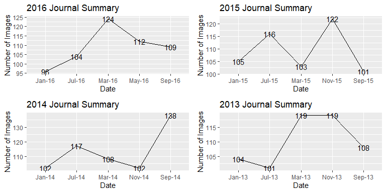
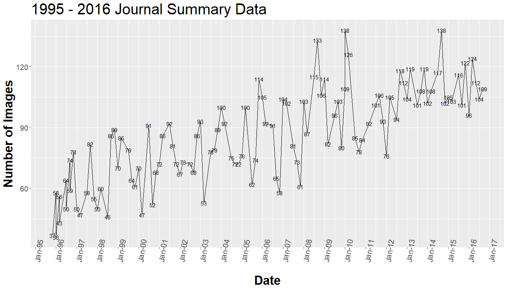
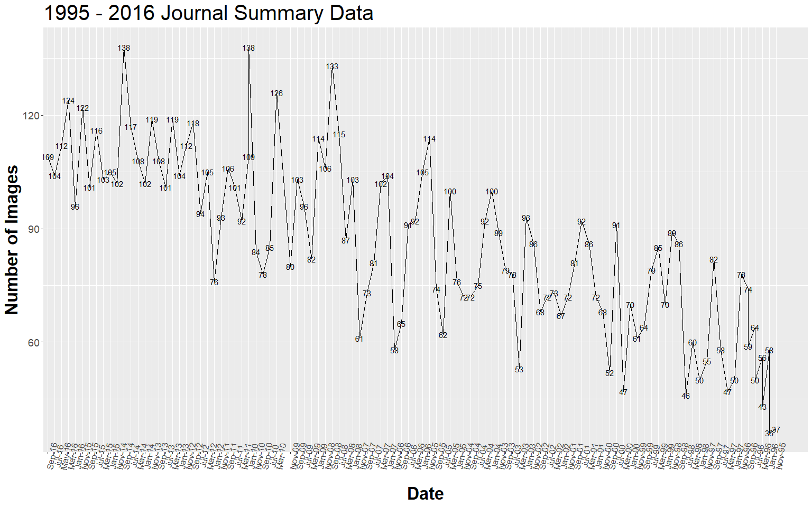

Journal-Summary-Time-Sequence-Data
================

``` r
library(ggplot2)
library(readr)
library(gridExtra)
df = read.csv("https://www.dropbox.com/s/lmfndjlvqbrjd9x/Journal%20Summary%20.csv?dl=1")
```

``` r
df2016 = df[1:5,]
df2015 = df[6:10,]
df2014 = df[11:15,]
df2013 = df[16:20,]
df2012 = df[21:25,]
df2011 = df[26:30,]
df2010 = df[31:35,]
df2009 = df[36:40,]
df2008 = df[41:45,]
df2007 = df[46:50,]
df2006 = df[51:55,]
df2005 = df[56:60,]
df2004 = df[61:65,]
df2003 = df[66:70,]
df2002 = df[71:75,]
df2001 = df[76:80,]
df2000 = df[81:85,]
df1999 = df[86:90,]
df1998 = df[91:95,]
df1997 = df[96:100,]
df1996 = df[101:105,]
df1995 = df[106:110,]

df2 = df[1:110,]
```

``` r
p2016 = ggplot(df2016, aes(x = Date, y = X..of.images, group = 1))+ geom_line()+geom_text(aes(label=X..of.images))+ ggtitle("2016 Journal Summary")+ ylab("Number of Images")

p2015 = ggplot(df2015, aes(x = Date, y = X..of.images, group = 1))+ geom_line()+geom_text(aes(label=X..of.images))+ ggtitle("2015 Journal Summary")+ ylab("Number of Images")

p2014 = ggplot(df2014, aes(x = Date, y = X..of.images, group = 1))+ geom_line()+geom_text(aes(label=X..of.images))+ ggtitle("2014 Journal Summary")+ ylab("Number of Images")

p2013 = ggplot(df2013, aes(x = Date, y = X..of.images, group = 1))+ geom_line()+geom_text(aes(label=X..of.images))+ ggtitle("2013 Journal Summary")+ ylab("Number of Images")

grid.arrange(p2016,p2015, p2014, p2013, nrow = 2)
```



``` r
df2 = df[1:110,]
df2$Date = paste("01", as.character(df2$Date), sep = "-")
df2$Date = as.Date(df2$Date, format = "%d-%b-%y")
str(df2)
```

    ## 'data.frame':    110 obs. of  5 variables:
    ##  $ Year        : Factor w/ 24 levels "","1995","1996",..: 23 1 1 1 1 22 1 1 1 1 ...
    ##  $ Date        : Date, format: "2016-09-01" "2016-07-01" ...
    ##  $ Vol         : Factor w/ 33 levels "","Vo. 104","Vo. 84",..: 17 17 2 17 17 16 16 17 17 16 ...
    ##  $ issue       : int  5 4 3 2 1 5 4 3 2 1 ...
    ##  $ X..of.images: int  109 104 112 124 96 122 101 116 103 105 ...

``` r
p2 = ggplot(df2, aes(x = Date, y = X..of.images, group = 1))+ geom_line()+geom_text(aes(label=X..of.images))+ ggtitle("1995 - 2016 Journal Summary Data")+ ylab("Number of Images")+theme(axis.text.x = element_text(size = 15,angle = 80))+scale_x_date(date_breaks = "1 year", date_labels = "%b-%y")+theme(axis.text=element_text(size=14),axis.title=element_text(size=25,face="bold"),plot.title = element_text(size=30))  

p2
```



``` r
df2 = df[1:110,]
str(df2)
```

    ## 'data.frame':    110 obs. of  5 variables:
    ##  $ Year        : Factor w/ 24 levels "","1995","1996",..: 23 1 1 1 1 22 1 1 1 1 ...
    ##  $ Date        : Factor w/ 106 levels "","Jan-00","Jan-01",..: 102 38 64 59 17 80 101 37 58 16 ...
    ##  $ Vol         : Factor w/ 33 levels "","Vo. 104","Vo. 84",..: 17 17 2 17 17 16 16 17 17 16 ...
    ##  $ issue       : int  5 4 3 2 1 5 4 3 2 1 ...
    ##  $ X..of.images: int  109 104 112 124 96 122 101 116 103 105 ...

``` r
p3 = ggplot(df2, aes(x = Date, y = X..of.images, group = 1))+ geom_line()+geom_text(aes(label=X..of.images))+ ggtitle("1995 - 2016 Journal Summary Data")+ ylab("Number of Images")+theme(axis.text.x = element_text(size = 12,angle = 80))+scale_x_discrete(limits = df2$Date)+theme(axis.text=element_text(size=14),axis.title=element_text(size=25,face="bold"),plot.title = element_text(size=30))  


p3
```


